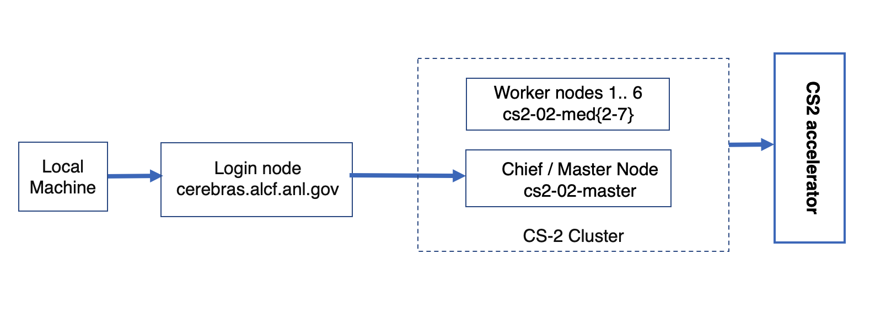

# Connecting to a CS-2 node

<!---These instructions presume that you have completed steps 1 and 2 on ALCFs
<a href="https://www.alcf.anl.gov/support-center/get-started">Get Started - Follow these steps to get your research project up and running on ALCF computing resources</a>--->


Connection to a CS-2 node is a two step process. <br>
The first step requires a MFA passcode for authentication - either a 8 digit passcode generted by an app on your mobile device (e.g. mobilePASS+) or a CRYPTOCard-generated passcode prefixed by a 4 digit pin.<br>
*In the examples below, <strong>replace ALCFUserID with your ALCF user id.</strong>*<br>
<!---[TODO the need for the second authentication step may be eliminated soon.]<br>--->
<!---[TODO testbed-cs2-01-med8.ai.alcf.anl.gov is not currently accessible]<br>--->
To connect to a CS-2 ("chief") node:<br>

(1) From the local machine, ssh to the login node first: <br>

|                                                                             |
|-----------------------------------------------------------------------------|
| **ssh ALCFUserID@cerebras.alcf.anl.gov** |

(2) From the login node, ssh to the destination CS-2 chief node:<br>

|                                                                             |
|-----------------------------------------------------------------------------|
| **ssh cs2-02-med8** |

Alternatively, this maybe done in one command line from the local machine. (two passcodes required):

|                                                                             |
|-----------------------------------------------------------------------------|
| **ssh -o "ProxyJump ALCFUserID@cerebras.alcf.anl.gov" ALCFUserID@cs2-02-med8 ** |

## Setup the environment
After sshing to the CS-02 chief node,
```bash
source /software/cerebras/cs2-02/envs/cs_env.sh<br>
```
This will add some CS2 scripts to the path, and set the CS_IP environment variable. 

<br>
## Copying files

To copy a file to your CS-2 home dir, *replacing <strong>both instances</strong> of ALCFUserID* with your ALCF user id*:

|                                                                                  |
|----------------------------------------------------------------------------------------------------------------------|
| **scp -o "ProxyJump ALCFUserID@cerebras.alcf.anl.gov" filename ALCFUserID@cs2-02-med8:~/** |

To copy a file from your CS-2 home dir to the current local directory, *replacing <strong>both instances</strong> of ALCFUserID* with your ALCF user id:

|                                                                                  |
|----------------------------------------------------------------------------------|
| **scp -o "ProxyJump ALCFUserID@cerebras.alcf.anl.gov" ALCFUserID@cs2-02-med8:~/filename .** |


