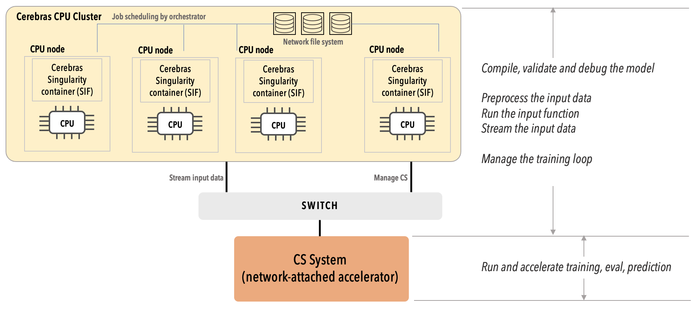

# System Overview
The Cerebras CS-2 is a wafer-scale deep learning accelerator comprising 850,000 processing cores, each providing 48KB of dedicated SRAM memory for an on-chip total of 40GB and interconnected to optimize bandwidth and latency. Its software platform integrates popular machine learning frameworks such as TensorFlow and PyTorch. 
For more details, see Cerebras's whitepaper:
<a href="https://f.hubspotusercontent30.net/hubfs/8968533/Cerebras-CS-2-Whitepaper.pdf">Cerebras Systems: Achieving Industry Best AI Performance Through A Systems Approach</a>

Cerebras's current Python support is built around Cerebras Estimator, which inherits from TensorFlow Estimator. 
Cerebras Release 1.2 will introduce PyTorch support. 
Release 1.1 includes a preview of the PyTorch support. 

Keras models can be converted to TF Estimator and to Cerebras Estimator.  See <https://www.tensorflow.org/tutorials/estimator/keras_model_to_estimator>

The public Cerebras documentation is at: 
<https://docs.cerebras.net/en/latest/index.html> 
Instructions for viewing the release 1.1.0 documentation are at [viewing-the-cerebras-v-11-documenation](Miscellaneous.md#viewing-the-cerebras-v-11-documenation)

An ANL CS-2 cluster will look similar to the following diagram (but with 8 worker nodes). The worker nodes and the chief node each have Intel(R) Xeon(R) Gold 6248 CPU processors totaling 80 cores and 200GB memory. 
[TODO say something about filesystems when we have at least one stable system.]	

(diagram from
[https://docs.cerebras.net/en/latest/getting-started/checklist-before-you-start.html](https://docs.cerebras.net/en/latest/getting-started/checklist-before-you-start.html))

The CS system is responsible only for running and accelerating the actual training and predictions with the model.

All the supporting tasks such as compiling the model, preprocessing the input data, running the input function, streaming the data, and managing the training loop, are executed in the Cerebras CPU cluster by the Cerebras software running on these nodes.

<!---https://docs.cerebras.net/en/latest/_images/compile-vs-run.png-->
(diagram from [https://docs.cerebras.net/en/latest/cerebras-basics/how-cerebras-works.html](https://docs.cerebras.net/en/latest/cerebras-basics/how-cerebras-works.html))
