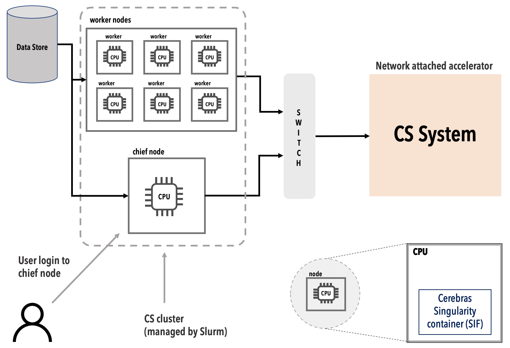

Cerebras
========

### System Overview
The Cerebras CS-2 is a wafer-scale deep learning accelerator comprising 850,000 processing cores, each providing 48KB of dedicated SRAM memory for an on-chip total of 40GB and interconnected to optimize bandwidth and latency. Its software platform integrates popular machine learning frameworks such as TensorFlow and PyTorch.

*Cerebras's current Python support is built around Cerebras Estimator, which inherits from TensorFlow Estimator.*
Cerebras Release 1.2 will introduce PyTorch support. Release 1.1 includes a preview of the PyTorch support. 

Keras models can be converted to TF Estimator and to Cerebras Estimator.  See <https://www.tensorflow.org/tutorials/estimator/keras_model_to_estimator>

The materials from the Cerebras training workshop 21 March 2021 are available on Box. They include videos.
[Cerebras\_Training\_March\_2021](https://anl.app.box.com/s/be1w6pqre8sda2jqwb65czk0o3hv2tho)

TODO need a pointer to a mirror of the current Cerebras public documentation

An ANL CS-2 cluster will look similar to the following diagram (but with 8 worker nodes). The worker nodes and the chief node each have two AMD EPYC 7702P 64-Core processors and 128 GB memory (131603444). [TODO verify with Ryan; that's from "free" and /proc/cpuinfo) [TODO something about filesystems when we have at least one stable system.]

