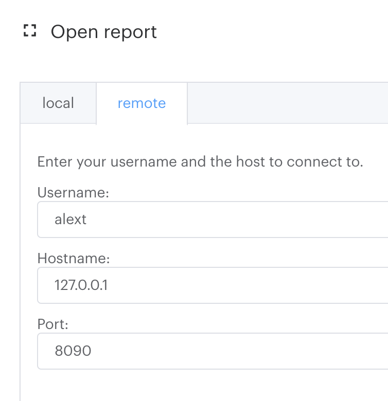

# Profiling

This is an adaptation of [Capturing IPU Reports](https://docs.graphcore.ai/projects/graph-analyser-userguide/en/latest/user-guide.html#capturing-ipu-reports).

## From Alex

Yes - you will need to tunnel a port through ssh like ssh .... -L 8090:127.0.0.1:22 and then open the "remote" report in the Graph Analyser using Hostname 127.0.0.1 and Port 8090.

```text
     -J destination
             Connect to the target host by first making a ssh connection to the jump host described by destination and then establishing a TCP forwarding to the
             ultimate destination from there.  Multiple jump hops may be specified separated by comma characters.  This is a shortcut to specify a ProxyJump con‐
             figuration directive.  Note that configuration directives supplied on the command-line generally apply to the destination host and not any specified
             jump hosts.  Use ~/.ssh/config to specify configuration for jump hosts.

     -K      Enables GSSAPI-based authentication and forwarding (delegation) of GSSAPI credentials to the server.

     -k      Disables forwarding (delegation) of GSSAPI credentials to the server.

     -L [bind_address:]port:host:hostport
     -L [bind_address:]port:remote_socket
     -L local_socket:host:hostport
     -L local_socket:remote_socket
             Specifies that connections to the given TCP port or Unix socket on the local (client) host are to be forwarded to the given host and port, or Unix
             socket, on the remote side.  This works by allocating a socket to listen to either a TCP port on the local side, optionally bound to the specified
             bind_address, or to a Unix socket.  Whenever a connection is made to the local port or socket, the connection is forwarded over the secure channel,
             and a connection is made to either host port hostport, or the Unix socket remote_socket, from the remote machine.

             Port forwardings can also be specified in the configuration file.  Only the superuser can forward privileged ports.  IPv6 addresses can be specified
             by enclosing the address in square brackets.

             By default, the local port is bound in accordance with the GatewayPorts setting.  However, an explicit bind_address may be used to bind the connec‐
             tion to a specific address.  The bind_address of “localhost” indicates that the listening port be bound for local use only, while an empty address
             or ‘*’ indicates that the port should be available from all interfaces.
```



## Download PopVision

1. Download [PopVision Tools](https://www.graphcore.ai/developer/popvision-tools).

2. Click **Download Now** button.

3. In the **Graph Analyser** section, select you operating system.

4. Install per selected operating system.

## Execution

Launch **Graph Analyser**.

See [Capturing IPU Reports](https://docs.graphcore.ai/projects/graph-analyser-userguide/en/latest/user-guide.html#capturing-ipu-reports) for more information.

### Capturing IPU Reports

This section describes how to generate the files that the Graph Analyser can analyse. The Graph Analyser uses report files generated during compilation and execution by the Poplar SDK.

### lkjsldfs

```bash
POPLAR_ENGINE_OPTIONS='{"autoReport.all":"true", "autoReport.directory":"./reports"}'
```

### IPU Memory Overhead

Because of all these extra memory requirements, a model with high memory consumption may go out of memory when profiling is enabled. Depending on the model, you can adjust its parameters to leave space for the instrumentation. For example, you can try decreasing the batch size. In TensorFlow BERT you can adjust the micro batch-size.

### Host Computing Overhead

It is essential that you also try to reduce the iterations on each run. For instance, by reducing the number of steps or the number of batches per step you can get a lighter execution profile. This will not only reduce the host computation overhead but will also speed up visualisation in the Graph Analyser.
