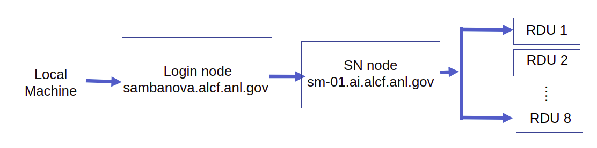

# Getting Started

## On-Boarding

See [Get Started](https://www.alcf.anl.gov/support-center/get-started)
to request an acccount and additional information.

## Setup

### System View

Connection to a **Habana** node is a two step process. First step is to ssh to a "login node".
This step requires a MFA passcode for authentication - an
eight digit passcode generated by an app on your mobile device, e.g. mobilePASS+.
The second step is to login to a **Habana** node from the login node.



### Login to Login Node

Login to the SambaNova login node from your local machine using the below command. This uses the MobilPass+ token generated everytime you login to the system. This is the same passcode used to authenticate into other ALCF systems, such as Theta and Cooley.

In the examples below, replace **ALCFUserID** with your ALCF user id.

**NOTE: These are not the final log in directions.
They are temporary until Go Live for this system.**

I am using this command courtesy of Bill.
You may skip the other steps for now.

```bash
ssh -J ALCFUserID@homes.cels.anl.gov ALCFUserID@habana-01.ai.alcf.anl.gov
```

```bash
ssh -J wilsonb@homes.cels.anl.gov wilsonb@habana-01.ai.alcf.anl.gov
```

```bash
ssh ALCFUserID@homes.cels.anl.gov
ALCFUserID@habana.alcf.anl.govs password: < Your cels password MobilPass+ code >
```

Note: Use the ssh "-v" option in order to debug any ssh problems.

### Login to a Habana Node

Once you are on the login node, the **Habana** system can be accessed using the alias “hb-01” that resolves to hostname hb-01.ai.alcf.anl.gov.

```bash
ssh ALCFUserID@@habana-01.ai.alcf.anl.gov
```
