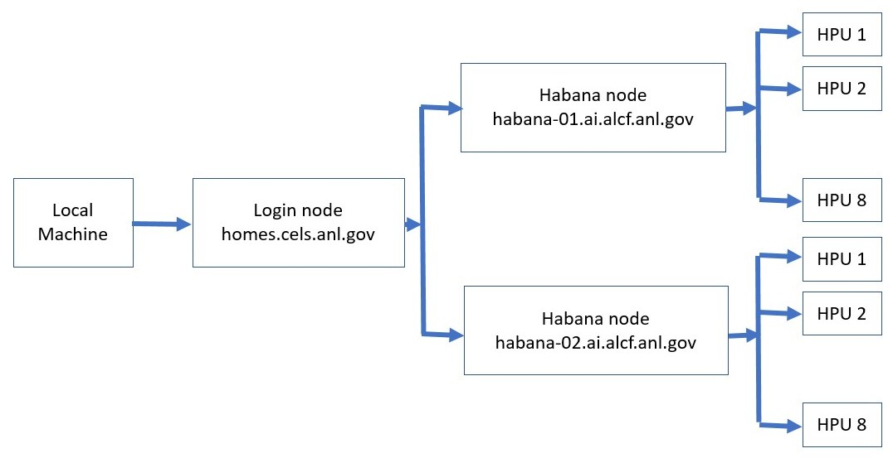

# Getting Started

## Setup

### System View

Connection to a **Habana** node is a two step process.
First step is to ssh to a CELS "login node", e.g., **homes**.

The second step is to login to a **Habana** node from the login node.



### Login to Login Node

Login to the **homes** login node from your local machine using the below command. This uses your public key everytime you login to the system.

In the examples below, replace **CELSGCEUserID** with your CELS GCE user id.

```bash
ssh CELSGCEUserID@homes.cels.anl.gov
```

Note: Use the ssh "-v" option in order to debug any ssh problems.

### Login to a Habana Node

Once you are on the login node, the **Habana** system can be accessed using one of these commands:

```bash
ssh CELSGCEUserID@habana-01.ai.alcf.anl.gov
# Or
ssh CELSGCEUserID@habana-02.ai.alcf.anl.gov
```

Note: Even though the hostname is ALCF, we will use our **CELSGCEUserID**.
