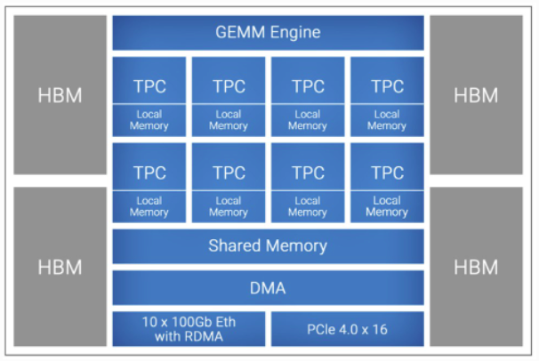

# System Overview

## Introduction

The Habana system has two nodes, i.e., habana-01 and habana-02.
Each node has eight Gaudi processors.

The system supports **PyTorch** and **TensorFlow** frameworks.

The **Gaudi** architecture includes a cluster of fully programmable **TPCs**, Tensor Processing Cores.
Along with development tools and libraries, and a configurable Matrix Math Engine.

The **TPC** is a **VLIW SIMD**, Very Long Instruction Word Single Instruction Multiple Data,
processor.  And, it is programmable, providing the user flexibility.

The **TPC** natively supports the following data types: FP32, BF16, INT32, INT16,
INT8, UINT32, UINT16, and UINT8.

Each Gaudi has 32 GB HBM, High Bandwidth Memory.
Here is the **Gaudi** processor high-level architecture.

See [Gaudi Architecture](https://docs.habana.ai/en/latest/Gaudi_Overview/Gaudi_Architecture.html) for more information.
