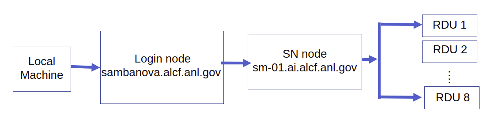

# How to Setup Your Base Environment

## On-Boarding

See [Get Started](https://www.alcf.anl.gov/support-center/get-started)
to request an acccount and additional information.

## Setup

### System View



### Login to Login Node

Login to the SambaNova login node.

```bash
ssh ALCFUserID@sambanova.alcf.anl.gov
ALCFUserID@sambanova.alcf.anl.govs password: < MobilPass+ code >
```

Use the ssh "-v" switch to debug ssh problems.

### Login to SambaNova Node

Login to sm-01 using:

```bash
ssh sm-01
```

### Aliases

The SambaNova system has a bash shell script to setup the environment.

Use

```bash
ALCFUserID@sm-01:~$ source /software/sambanova/envs/sn_env.sh
(venv) ALCFUserID@sm-01:~$
```

```bash
alias snpath='export PATH=$PATH:/opt/sambaflow/bin' # This is the path to SambaFlow which is the software stack that is running on SambaNova systems. This stack includes the Runtime, the compilers, and the SambaFlow Python SDK which is used to create and run models.

alias snthreads='export OMP_NUM_THREADS=1' # The OMP_NUM_THREADS environment variable sets the number of threads to use for parallel regions. The value of this environment variable must be a list of positive integer values. The values of the list set the number of threads to use for parallel regions at the corresponding nested levels.For the SambaNova system it is usually set to 1.

alias snvenv='source /opt/sambaflow/venv/bin/activate' # This activates the pre-configured virtual environment that consists of sambaflow and other built-in libraries.
```

**NOTE:  SambaNova operations will fail unless the SambaNova venv is set
up.**

You may deactivate the environment if finished.

```bash
deactivate
```

### OMP_NUM_THREADS

The OMP_NUM_THREADS environment variable sets the number of threads to use for parallel regions.

The value of this environment variable must be a list of positive integer values. The values of the list set the number of threads to use for parallel regions at the corresponding nested levels.

For the SambaNova system it is usually set to one.  However, there are
are times when it is beneficial to set the number of threads to a
larger number.  There are some libraries used by runtime that react to OMP_NUM_THREADS.
If profiling reveals a lot of time on the host either in loading or say a custom loss
calculation you may want to do a sweep varying OMP_NUM_THREADS.
