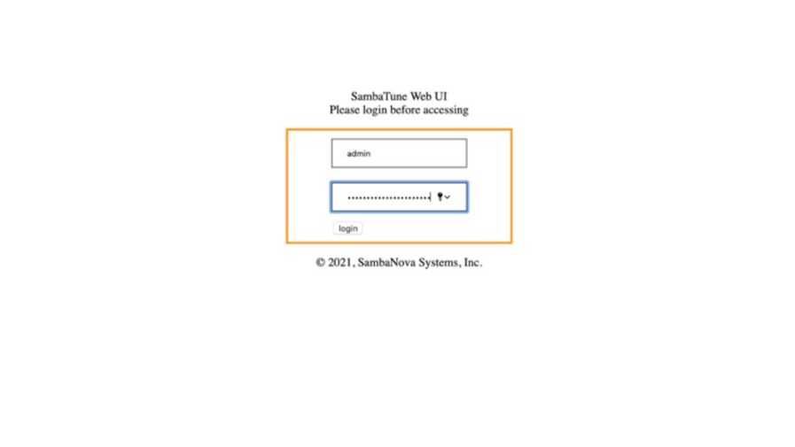
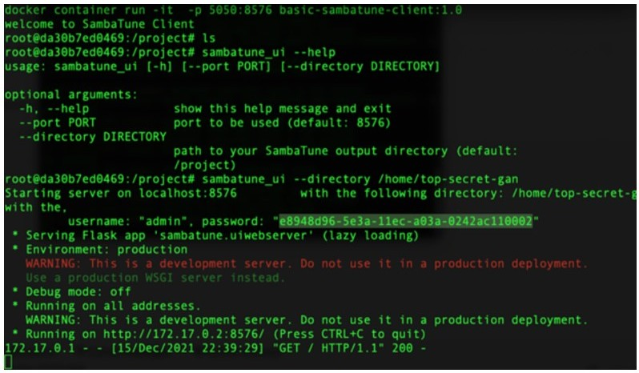

# SambaTune User Guide

## About SambaTune

SambaTune is a tool for profiling, debugging and tuning performance of applications
running on SN hardware.

The tool automates collection of hardware performance counters, metrics aggregation,
report generation and visualization. It also automates benchmarking of the application
to compute average throughput over a sufficient number of runs. The tool is designed to
aid the user with performance bottleneck analysis and tuning.

SambaTune is currently used by SN engineers involved in performance tuning efforts.
SambaTune is also planned for release to external customers to aid with performance
bottleneck analysis and resolution.

## Installation

First, enter the virtual environment on **sm-01** or **sm-02**:

```bash
source /opt/sambaflow/venv/bin/activate
```

## Usage

```console
usage: sambatune [-h] [--artifact-root ARTIFACT_ROOT] [--disable-override]
[--compile-only | -m MODES [MODES ...]]
[--version]
config
positional arguments:
config
YAML file with model, compile, run configuration.
optional arguments:
-h, --help
--artifact-root
show this help message and exit
ARTIFACT_ROOT
Custom location to save compile/run artifacts;
defaults to '$DUMP_ROOT/artifact_root'
--disable-override Reuse the placement from the baseline compilation
--compile-only Run compilation of PEFs for selected modes only
-m MODES [MODES ...], --modes MODES [MODES ...]
Select modes to execute from ['benchmark',
'instrument', 'run'] default: ['benchmark']
--version
version of sambatune and sambaflow.
```

### Example

Let’s get started with a simple run:

```bash
sambatune linear.yaml
```

where **linear.yaml** is a user-specified configuration file:

```yaml
app: /path/to/linear.py
model-args: -b 128 -mb 64 --in-features 512 --out-features 128
compile-args: compile --plot
run-args: -n 10000
```

Once you have the sambaflow-apps package installed, you can use some pre-defined
configurations. Example using **linear_net.yaml**:

```bash
sambatune /opt/sambaflow/sambatune/configs/linear_net.yaml
sambatune /opt/sambaflow/sambatune/configs/linear_net.yaml --artifact-root . -m 'benchmark'
xxsambatune app.yaml --artifact-root ARTIFACT_ROOT -m ‘benchmark’,‘instrument’,‘train’
xxsambatune /opt/sambaflow/sambatune/configs/linear_net.yaml --artifact-root . -m 'benchmark','instrument','train'


sambatune /opt/sambaflow/sambatune/configs/linear_net.yaml --artifact-root . -m 'benchmark'
sambatune /opt/sambaflow/sambatune/configs/linear_net.yaml --artifact-root . -m 'instrument'
sambatune /opt/sambaflow/sambatune/configs/linear_net.yaml --artifact-root . -m 'run'

```

By default, it will run with the benchmarking mode enabled. Use the --modes flag to run
modes individually or in any combination.
Benchmark-Only:

```bash
sambatune /opt/sambaflow/sambatune/configs/linear_net.yaml --mode benchmark#
```

Instrument-Only:

```bash
sambatune /opt/sambaflow/sambatune/configs/linear_net.yaml --mode instrument#
```

All modes:

```bash
sambatune /opt/sambaflow/sambatune/configs/linear_net.yaml --mode benchmark instrument run#
```

To learn about valid input configuration fields, please see Input Configuration Options (schema.pdf).

SambaTune will compile the **app** with the user-specified **model-args**, **compile-args**
and SambaFlow-supported instrumentation flags in order to enable programmable
hardware counters to collect performance data when the application executes on the
RDU.

After successful compile, SambaTune will run the application on the RDU and collect
performance counter data. It will also run the application in benchmark mode with user-
specified **run-args** to collect latency, throughput, and hardware utilization statistics.

At the end of a successful run, SambaTune will collate compile-time and run-time
statistics to generate performance reports. A web-based GUI will render the reports
contextually to help the user identify potential hotspots. To learn more about the
generated reports, please go to **Understanding the Reports** (reports-index.pdf).

## User Interface

The SambaTune UI provides a simple web-browser based interface to read the reports
generated by one or more SambaTune runs.

### Installation UI

There are two ways to use the SambaTune UI; you can bring it up from a Docker
instance or bring it up as a python wheel package. Both assume sambatune_ui is
installed on the **client** system where you don’t have direct access to RDU unlike the **host**
system.

### Docker Installation

In your client OS pull the docker image from the SambaNova artifactory as follows,

```bash
docker pull sambanova-sambatune-client:1.0
```

Launch docker image, (usually you also want to attach NFS or external partition to the
docker to mount the data generated from the

```bash
docker container run -it -p 5050:8576 basic-sambatune-client:1.0
```

To mount the sambatune_gen on your client system use the command,

```bash
docker container run --mount type=bind,source=/path/to/sambatune_gen,target =/project -it -p 5050:8576 basic-sambatune-client:1.0
```

The UI can then be invoked with the following command (within docker):

```docker
root@CLIENT:/project# sambatune_ui --directory /project
```

and point your localhost browser to http://localhost:5050 and use the username and
password printed on the console; keep your docker running so-long as you are using the
SambaTune UI.





### Python Wheel Package Installation

In your client OS (Unbuntu/Mac/Windows) system you are using to connect to the UI,
install the pre-requisites like virtualenv and Python v3.7. Initialize the virtual
environment,

```bash
virtualenv --system-site-packages -p python3.7 venv
source venv/bin/activate
```

Next install the **sambatune_client** wheel package to get the **sambatune_ui** command

```bash
sudo pip install --prefix=/usr/local/ sambatune_client-1.0-py3-none-any.whl
chmod +x /usr/local/bin/sambatune_ui
```

Upon successful installation we expect your output like following,

```console
which sambatune_ui
/usr/local/bin/sambatune_ui
```

### Usage UI

```console
usage: sambatune_ui [-h] [--port PORT] [--directory DIRECTORY]
optional arguments:
  -h, --help                show this help message and exit
  --port PORT               port to be used (default: 8576)
  --directory DIRECTORY
                            path to your SambaTune output directory
```

© 2022 SambaNova Systems, Inc. Proprietary and Confidential Information
